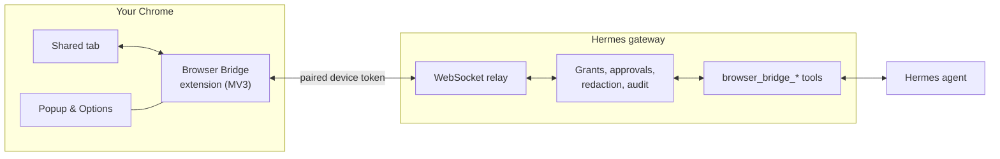

# Hermes Browser Bridge

# What it is

A Chrome extension and a Hermes gateway plugin. Together, they let a Hermes agent work in tabs you share from your own Chrome session right along side of you.

## Why it exists

Hermes has its own browser, but sometimes it's necessary for a human to drive.

This gives Hermes eyes and hands into your local browser to see and (if you choose) manipulate whatever you can see and touch in your browser. This is super useful if whatever app you're working in has no usable API or is only authenticated through JWT. Tons of reasons why you would want Hermes to work alongside you, or even unattended on your local browser if you really want.

Three quick notes:

* I recommend using a model with image capabilities with this Plugin. It helps to give Hermes eyes instead of just hands.
* Model speed greatly affects how quickly your task can be completed. A pair of DGX Sparks running Qwen 3.8 Flash Next was able to perform a full Ubuntu OS install from VMWare's web console in about 15 minutes on its first run.
* Successive runs should complete more quickly than the first. This plugin is self-learning and self-correlating using the Skills Link function (see below for more on this).

## Chrome extension

The meat of this entire project is the Chrome extension. It's what you will be interacting with most, and what allows your agent to be portable onto any desktop OS browser (as long as you have network reachability back to your Hermes instance through the local network or something like Tailscale).

Install the extension, point it at your Hermes install, and configure the Powers that you are giving your agent.

<p>
  
  
  
</p>

(Tab titles and addresses are redacted here)

## What are Powers?

Good question! Think of them as gates for tool calls. They are abilities that you provide or take away from your agent so it can perform actions like upload files, accept/dismiss message boxes, run Javascript, interact with dev console, read/write cookies, etc.

The more Powers you give your agent, the more it can do... which coincidentally makes it potentially more dangerous to run unattended.

## What it can do

**Sharing and control**
- The agent sees nothing until you share a tab. Pause, release, or press Alt+Shift+S to stop.
- Each site has an access mode: `off`, `request` (ask first) or `full`. The default for new sites is set in Options; change a site from its card in the popup.
- A session holds a lease on its tabs so two agents can't work in the same one. Lease length is 10 to 1,200 seconds, or unlimited.
- The agent works in the background and does not bring its tab or window to the front.
- An on-page pointer and label show each action. Speed is Normal, Fast or Off.

**Reading a page**
- `snapshot`: a numbered list of interactive elements, including those inside iframes and shadow DOM. It can be limited to a dialog, a subtree or the viewport, and element numbers stay the same until the element is removed.
- `find`: search the whole page by text or role.
- `inspect`: layout questions without a screenshot. What scrolls, what is at a point, whether something is visible or clipped, a control's options, a form's state.
- `read`: page text without markup.
- `screenshot`: scaled JPEG by default, with optional region crops and numbered markers.
- Up to five tabs can be read in one call.

**Acting**
- Click, type, select, submit, hover, drag, press keys, navigate and wait for a condition.
- Scroll the page or a specific container. Infinite-scroll lists can wait for new rows to load.
- `act` runs up to 20 steps in one call and stops at the first failure. `fill` sets a whole form in one call.
- Native JavaScript dialogs, file uploads and download history.
- `ask` puts a numbered question on the page when the agent can't tell what to click.

**Page APIs and debugging**
- `fetch` sends an API request from inside the tab, with the tab's cookies and CSRF headers. Requests can only go to the tab's own origin or to sites you've granted.
- Console output, network requests, and `evaluate` for running JavaScript (always asks first).
- Cookie metadata, and cookie writes with approval.
- HTTP sign-in: stage a basic or digest credential in the popup. The agent can see that one is staged, never the credential.

**Sessions**
- Named sessions can be resumed later with their approvals.
- Tabs get short names and roles in a session. The agent can close tabs it opened, never yours.

## Skills Link

Browser Bridge uses a custom `Skills Link` to correlate known skills with whatever you're accessing in your local browser.

That means if your Hermes agent already understands how to use something like VMWare vCenter, it can correlate the known skill with the website that it is visiting. Likewise, the app helps Hermes learn that it can use Browser Bridge (when a session is active) as part of its Skills Library for VMWare vCenter in the future.

*An example of this*:

I had Hermes use Browser Bridge to access VMWare ESXI and stand up a new Ubuntu virtual machine. It learned how to interact with VMWare's web console, browse and search datastores, and how to adapt to the console's latency affecting keystroke drops. It also learned how to handle the Ubuntu OS install directly from a visual console using OCR to turn a snapshot of the console image into actionable form fields that it could use keyboard controls to manipulate.

## Safety controls

- The gateway and the extension both enforce each site's access mode.
- Evaluate, upload, console, downloads, cookie writes and HTTP sign-in each need a setting turned on in Options, plus an approval (if you have approvals turned on).
- Each iframe is checked against its own origin.
- PII can be redacted before it's shipped to your agent. Passwords, card numbers, ID numbers, email addresses, phone numbers, and more can be redacted before they leave the page. Console output can also be scrubbed of tokens and keys.
- Page text is marked as untrusted in every result, and text that tries to instruct the agent is flagged to help minimize successful attempts at prompt injection.
- Optional pause before committing clicks such as Submit, Send, Pay or Delete. The default is Auto proceed.
- Optional replay: one small frame and a caption per action (no typed text). Session data can be exported and then replayed later.
- Every tool call is logged with its session. `hermes browser-bridge revoke <device>` cuts a device off immediately.
- Devices pair with a one-time code, and tokens are stored hashed.

## Password managers

Chrome blocks the debugger on any tab that contains another extension's frame, and password managers add those frames to login pages.

The bridge removes password managers them while it attaches and puts them back, or holds new ones while the tab is shared. If Chrome still refuses to attach the Bridge, it shares the tab in limited mode (actions run through the page) until full access is possible again. You don't need to turn the password manager off.

## How it works



- The extension drives shared tabs through Chrome's debugger protocol and a small content script.
- The plugin runs the relay inside the gateway, registers the tools, and owns pairing, grants, approvals and the audit log.
- Both sides are generated from one protocol schema and negotiate versions on connect.
- A bundled skill tells each Hermes session how to use the tools and recover from refusals.
- The tools are only offered while a paired device is online.

## Install

Requirements: a Hermes gateway (v0.19 or later) and Chrome 116 or later on a machine that can reach the gateway on port 8765.

| Folder | Contents |
|---|---|
| `browser-bridge/` | Gateway plugin and its skill. |
| `chrome-extension/` | The extension, ready to load unpacked. |

1. Copy the plugin to the gateway host:
   ```bash
   cp -r browser-bridge ~/.hermes/plugins/browser-bridge
   ```
   Add `browser-bridge` to `plugins.enabled` in `~/.hermes/config.yaml` and restart the gateway. Optional settings go in a `browser_bridge:` block (`host`, `port`, `default_mode`, `vision`).
2. In Chrome, open `chrome://extensions`, turn on Developer mode, choose **Load unpacked** and select `chrome-extension`.
3. Open the popup and enter the gateway address, for example `ws://your-gateway-host:8765/bridge`.
4. On the gateway, run the command below and enter the code in the popup:
   ```bash
   hermes browser-bridge pair
   ```
5. Share a tab.

## Tools

| Tool | Purpose |
|---|---|
| `browser_bridge_status` | Devices, shared tabs, access modes, pending approvals. |
| `browser_bridge_attach` / `_release` | Start and stop working in a tab. |
| `browser_bridge_open_tab` | Open a URL in a new tab and attach it. |
| `browser_bridge_tabs` | The session's tabs, with names, roles and URLs. |
| `browser_bridge_session` | Create, list, resume, rename or close a session. |
| `browser_bridge_snapshot` | Numbered list of the page's controls. |
| `browser_bridge_find` | Search every frame and shadow root for text or a role. |
| `browser_bridge_read` | Page text. |
| `browser_bridge_screenshot` | Image of the page or a region. |
| `browser_bridge_inspect` | One layout question: scrollables, point, visibility, options, form state. |
| `browser_bridge_act` | Click, type, fill, select, scroll, key, hover, drag, navigate, wait, or a batch of steps. |
| `browser_bridge_ask` | Ask the user to pick an element. |
| `browser_bridge_dialog` | Answer a native JavaScript dialog. |
| `browser_bridge_upload` | Fill a file input from permitted files. |
| `browser_bridge_downloads` | Download history for shared sites. |
| `browser_bridge_evaluate` | Run JavaScript in the page, with approval. |
| `browser_bridge_fetch` | Send an API request from inside the tab. |
| `browser_bridge_network` | Requests the page made. |
| `browser_bridge_console` | Console output and exceptions. |
| `browser_bridge_cookies` / `_cookie_set` | Read cookie metadata; write one with approval. |
| `browser_bridge_http_auth_status` | Whether an HTTP sign-in credential is staged. |

Gateway CLI: `hermes browser-bridge pair | devices | status | logs | export | revoke`. `logs --timing` shows per-tool timings.

## Documentation

The agent guide ships with the plugin: [`browser-bridge/skill/SKILL.md`](browser-bridge/skill/SKILL.md). It covers which tool to use, how to target elements, access modes and approvals, and every refusal code with its fix.

## License

MIT
