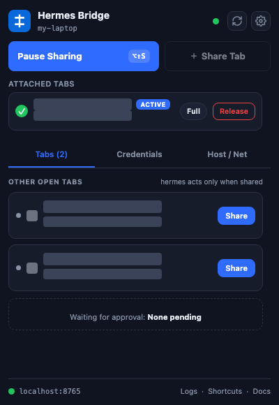
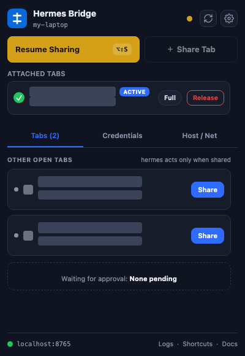
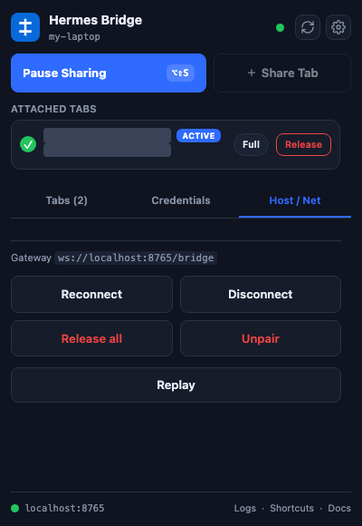
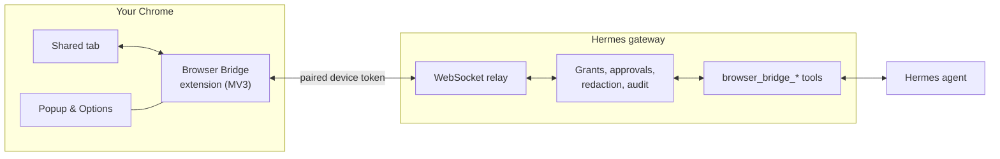

# Hermes Browser Bridge

A Chrome extension and a Hermes gateway plugin. Together they let a Hermes agent work in tabs you share from your own Chrome, using the logins you already have.

## Why it exists

A lot of internal tooling only works in a signed-in browser: ticketing systems, hypervisor consoles, backup and network dashboards, admin panels. They sit behind SSO or MFA and often have no usable API. A headless browser has to sign in again and usually can't. This bridge gives the agent your existing session instead, limited to the tabs you share and the rules you set.

## The popup

<p>
  
  
  
</p>

Tab titles and addresses are redacted. The status light is green when live, yellow when paused or reconnecting, and red when disconnected. The Tabs, Credentials and Host / Net tabs hold everything else.

## What it does

**Sharing and control**
- The agent sees nothing until you share a tab. Pause, release, or press Alt+Shift+S to stop.
- Each site has an access mode: `off`, `request` (ask first) or `full`. The default for new sites is set in Options; change a site from its card in the popup.
- A session holds a lease on its tabs so two agents can't work in the same one. Lease length is 10 to 1,200 seconds, or unlimited.
- The agent works in the background and does not bring its tab or window to the front.
- An on-page pointer and label show each action. Speed is Normal, Fast or Off.

**Reading a page**
- `snapshot`: a numbered list of interactive elements, including those inside iframes and shadow DOM. It can be limited to a dialog, a subtree or the viewport, and element numbers stay the same until the element is removed.
- `find`: search the whole page by text or role.
- `inspect`: layout questions without a screenshot. What scrolls, what is at a point, whether something is visible or clipped, a control's options, a form's state.
- `read`: page text without markup.
- `screenshot`: scaled JPEG by default, with optional region crops and numbered markers.
- Up to five tabs can be read in one call.

**Acting**
- Click, type, select, submit, hover, drag, press keys, navigate and wait for a condition.
- Scroll the page or a specific container. Infinite-scroll lists can wait for new rows to load.
- `act` runs up to 20 steps in one call and stops at the first failure. `fill` sets a whole form in one call.
- Native JavaScript dialogs, file uploads and download history.
- `ask` puts a numbered question on the page when the agent can't tell what to click.

**Page APIs and debugging**
- `fetch` sends an API request from inside the tab, with the tab's cookies and CSRF headers. Requests can only go to the tab's own origin or to sites you've granted.
- Console output, network requests, and `evaluate` for running JavaScript (always asks first).
- Cookie metadata, and cookie writes with approval.
- HTTP sign-in: stage a basic or digest credential in the popup. The agent can see that one is staged, never the credential.

**Sessions**
- Named sessions can be resumed later with their approvals.
- Tabs get short names and roles in a session. The agent can close tabs it opened, never yours.

## Safety controls

- The gateway and the extension both enforce each site's access mode.
- Evaluate, upload, console, downloads, cookie writes and HTTP sign-in each need a setting turned on in Options, plus an approval.
- Each iframe is checked against its own origin.
- Passwords, card numbers and national ID numbers are redacted before they leave the page. Email and phone redaction are optional. Console output is scrubbed of tokens and keys.
- Page text is marked as untrusted in every result, and text that tries to instruct the agent is flagged.
- Optional pause before committing clicks such as Submit, Send, Pay or Delete. The default is Auto proceed.
- Optional replay: one small frame and a caption per action, never typed text. Export it from the popup.
- Every tool call is logged with its session. `hermes browser-bridge revoke <device>` cuts a device off immediately.
- Devices pair with a one-time code, and tokens are stored hashed.

## Password managers

Chrome blocks the debugger on any tab that contains another extension's frame, and password managers add those frames to login pages. The bridge removes them while it attaches and puts them back, holds new ones while the tab is shared, and if Chrome still refuses, shares the tab in limited mode (actions run through the page) until full access is possible again. You don't need to turn the password manager off.

## How it works



- The extension drives shared tabs through Chrome's debugger protocol and a small content script.
- The plugin runs the relay inside the gateway, registers the tools, and owns pairing, grants, approvals and the audit log.
- Both sides are generated from one protocol schema and negotiate versions on connect.
- A bundled skill tells each Hermes session how to use the tools and recover from refusals.
- The tools are only offered while a paired device is online.

## Install

Requirements: a Hermes gateway (v0.19 or later) and Chrome 116 or later on a machine that can reach the gateway on port 8765.

| Folder | Contents |
|---|---|
| `browser-bridge/` | Gateway plugin and its skill. |
| `chrome-extension/` | The extension, ready to load unpacked. |

1. Copy the plugin to the gateway host:
   ```bash
   cp -r browser-bridge ~/.hermes/plugins/browser-bridge
   ```
   Add `browser-bridge` to `plugins.enabled` in `~/.hermes/config.yaml` and restart the gateway. Optional settings go in a `browser_bridge:` block (`host`, `port`, `default_mode`, `vision`).
2. In Chrome, open `chrome://extensions`, turn on Developer mode, choose **Load unpacked** and select `chrome-extension`.
3. Open the popup and enter the gateway address, for example `ws://your-gateway-host:8765/bridge`.
4. On the gateway, run the command below and enter the code in the popup:
   ```bash
   hermes browser-bridge pair
   ```
5. Share a tab.

## Tools

| Tool | Purpose |
|---|---|
| `browser_bridge_status` | Devices, shared tabs, access modes, pending approvals. |
| `browser_bridge_attach` / `_release` | Start and stop working in a tab. |
| `browser_bridge_open_tab` | Open a URL in a new tab and attach it. |
| `browser_bridge_tabs` | The session's tabs, with names, roles and URLs. |
| `browser_bridge_session` | Create, list, resume, rename or close a session. |
| `browser_bridge_snapshot` | Numbered list of the page's controls. |
| `browser_bridge_find` | Search every frame and shadow root for text or a role. |
| `browser_bridge_read` | Page text. |
| `browser_bridge_screenshot` | Image of the page or a region. |
| `browser_bridge_inspect` | One layout question: scrollables, point, visibility, options, form state. |
| `browser_bridge_act` | Click, type, fill, select, scroll, key, hover, drag, navigate, wait, or a batch of steps. |
| `browser_bridge_ask` | Ask the user to pick an element. |
| `browser_bridge_dialog` | Answer a native JavaScript dialog. |
| `browser_bridge_upload` | Fill a file input from permitted files. |
| `browser_bridge_downloads` | Download history for shared sites. |
| `browser_bridge_evaluate` | Run JavaScript in the page, with approval. |
| `browser_bridge_fetch` | Send an API request from inside the tab. |
| `browser_bridge_network` | Requests the page made. |
| `browser_bridge_console` | Console output and exceptions. |
| `browser_bridge_cookies` / `_cookie_set` | Read cookie metadata; write one with approval. |
| `browser_bridge_http_auth_status` | Whether an HTTP sign-in credential is staged. |

Gateway CLI: `hermes browser-bridge pair | devices | status | logs | export | revoke`. `logs --timing` shows per-tool timings.

## Documentation

The agent guide ships with the plugin: [`browser-bridge/skill/SKILL.md`](browser-bridge/skill/SKILL.md). It covers which tool to use, how to target elements, access modes and approvals, and every refusal code with its fix.

## License

MIT
